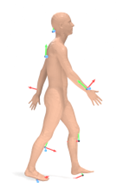
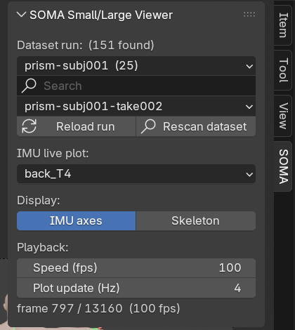
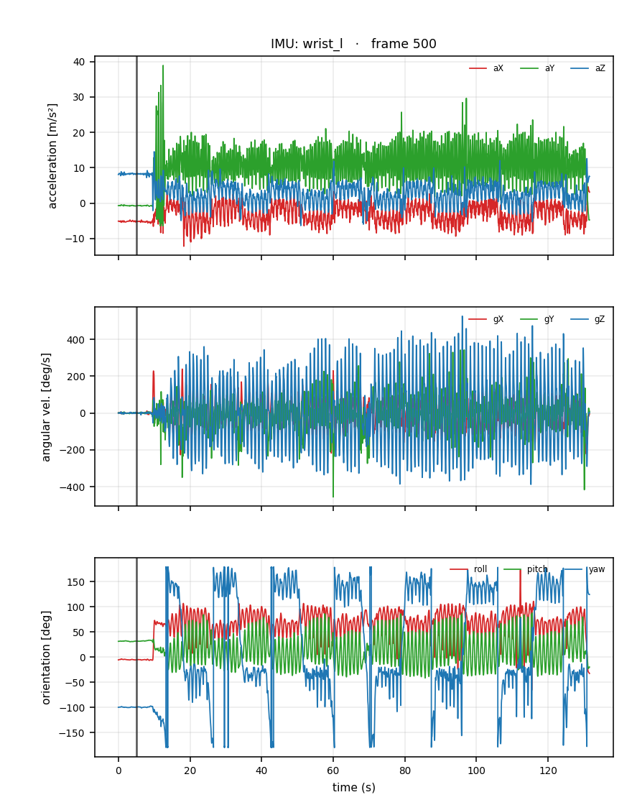
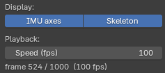

# 개요

이 뷰어는 PRISM 모션캡처의 **small / large / anthro** 참조 데이터로 재구성한 피험자의
**실제 체형 SMPL 인체 메시**와 **8개 IMU 위치의 RGB 센서 축**을 Blender 안에서 인터랙티브하게
보여준다. 영상(mp4)이 아니라 **돌려보고 재생·스크럽**할 수 있는 3D 장면이며, 여기에 두 가지
분석 기능(데이터 run 전환, IMU별 신호 라이브 플롯)이 얹혀 있다.

{width=62%}

- **체형**: 피험자 실제 SMPL betas로 만든 정확한 메시.
- **IMU 8곳**(센서 코드): `back_T4`(등·상부 흉추) · `occiput`(후두부) · `wrist_l`·`wrist_r`(손목) ·
  `shank_l`·`shank_r`(정강이) · `foot_l`·`foot_r`(발·인솔).
- **축 규약**: X=빨강, Y=초록, Z=파랑 (컴퓨터비전 표준 좌표계, `00_sensors.qmd` 스펙).

# 실행 방법 (설치 불필요)

이 뷰어는 **Windows 전용**이다.

1. 배포 폴더에서 `launch.exe`를 더블클릭한다.
2. 이 PC에 **Python · Blender · 애드온을 설치할 필요가 없다.** Blender·스크립트·플롯 라이브러리가
   모두 폴더 안에 들어 있다. 데이터는 이 PC의 번들에서 읽으므로 `SOMA_DATA_ROOT`를 설정해 둔다
   (아래 「데이터 위치와 새 run 추가」).
3. 첫 실행 시 Blender 스플래시가 잠깐 뜬 뒤 장면이 로드된다.

# 화면과 기본 조작

3D 뷰포트에서:

| 조작 | 키/마우스 |
|---|---|
| 재생 / 정지 | **Spacebar** |
| 궤도 회전 | 마우스 **가운데 버튼 드래그** |
| 확대 / 축소 | 마우스 **휠** |
| 프레임 이동 | 아래 타임라인 드래그 |

오른쪽 **`SOMA` 패널**에서 모든 기능을 제어한다. 패널이 보이지 않으면 3D 뷰에서 **`N` 키**를 눌러
사이드바를 켜고 `SOMA` 탭을 선택한다.

{width=44%}

# 기능

## 데이터 run 선택

run이 수백~수천 개가 되면 한 목록에 다 넣을 수 없으므로, `SOMA` 패널 상단은 **3단**으로 좁혀
간다.

| 순서 | 컨트롤 | 하는 일 |
|---|---|---|
| 1 | **컬렉션** 드롭다운 | 데이터셋·피험자 단위로 묶은 목록 (예: `prism_faithful_full/prism-subj001 (25)`). 괄호 안은 그 안의 run 개수 |
| 2 | **검색창** (돋보기) | 입력한 글자가 들어간 run만 남긴다 |
| 3 | **run** 드롭다운 | 위 두 조건에 맞는 run만 표시 |

컬렉션을 바꾸면 run 목록이 그 컬렉션으로 바뀌고, 첫 run이 자동으로 선택돼 인체·IMU 애니메이션이
다시 만들어진다(리그 재구성에 수 초~수십 초). `[Reload run]` 버튼으로 현재 run을 다시 빌드할 수도
있다. 한 컬렉션에 run이 아주 많으면 목록은 200개까지만 보여주고 **"showing N of M"**을 함께
표시하므로, 검색창으로 더 좁히면 된다(조용히 잘라내지 않는다).

**드롭다운을 열 때마다 데이터셋 폴더를 다시 검색**하므로, 뷰어를 켜 둔 채 새 run을 복사해 넣어도
목록에 나타난다. 곧바로 다시 찾게 하려면 `[Rescan dataset]` 버튼을 누른다. 맨 위에는 전체에서
찾은 run 개수가 표시된다.

## IMU 라이브 플롯

**[IMU live plot]** 드롭다운에서 IMU를 고르면, 그 센서의 신호가 옆 이미지 패널에 **3단**으로
표시된다 — 위에서부터 **가속도(m/s²) · 각속도(deg/s) · 방향(deg, roll·pitch·yaw)**. 각 패널의 세
선 색(빨강·초록·파랑)은 3D 화면의 RGB 축과 같은 X·Y·Z 축이다. 재생하면 **세로 커서**가 현재
프레임을 따라 움직인다.

{width=48%}

드롭다운의 이름은 `small_reference.npz`의 센서 코드와 동일하다: `back_T4`(등·상부 흉추) ·
`occiput`(후두부) · `wrist_l`·`wrist_r`(손목) · `shank_l`·`shank_r`(정강이) · `foot_l`·`foot_r`(발·인솔).

## 표시 토글

`SOMA` 패널 **Display** 줄의 두 토글로 화면을 정리한다.

{width=52%}

- **IMU axes** (기본 켜짐): 8개 IMU RGB 축의 표시/숨김.
- **Skeleton** (기본 꺼짐): SMPL 관절 뼈대(아마추어)의 표시/숨김. 관절마다 하나씩 24개가 있으므로
  기본은 숨김이다. 뼈대를 숨겨도 메시는 정상적으로 움직인다.

## 재생 속도

**[Speed (fps)]** 슬라이더로 재생 속도를 조절한다. 데이터가 100 Hz이므로 **100 = 실시간**(전체 10초),
낮추면 느리게(예: 25 → 4배 슬로), 높이면 빠르게. 무거운 장면이라 PC가 100 fps를 못 따라가면 실제
재생이 느려지는데, 이 뷰어는 **프레임 드롭** 방식이라 못 그리는 프레임을 건너뛰며 **실제 시간 속도로
재생**한다. 그래도 느리면 Speed를 낮춰 부드럽게 본다.

## 플롯 갱신 속도 (3D 부드러움)

**[Plot update (Hz)]** 슬라이더는 재생 중 IMU 플롯을 초당 몇 번 다시 그릴지 정한다(기본 `20`).
재생 중 가장 무거운 작업이 이 플롯 다시 그리기라서, **이 값을 낮추면 3D 화면이 더 부드러워진다.**

| 값 | 동작 |
|---|---|
| `20` (기본) | 초당 20회 갱신 — 커서가 재생을 바짝 따라간다 |
| `30` | 최대. 커서가 가장 촘촘하지만 3D는 느려질 수 있다 |
| `4`–`10` | 갱신을 줄여 3D를 우선 (`4`가 예전 기본값) |
| `1`–`2` | 거의 갱신하지 않음 |
| `0` | 재생 중에는 갱신하지 않음(정지·스크럽할 때만) — **3D가 가장 부드럽다** |

`0`으로 두어도 IMU를 바꾸거나 정지하면 플롯은 즉시 갱신된다.

# 데이터 위치와 새 run 추가

뷰어 안에는 데이터가 없다. 뷰어는 **실행한 PC의 번들**을 읽는다. 번들은 그것을 만든 PC에 두며
(ADR-0041), 그 PC의 데이터 루트는 환경변수 `SOMA_DATA_ROOT`가 가리킨다.

```
<SOMA_DATA_ROOT>\
├─ runs\experimental_generation_poc_demo\
│   ├─ <번들>\                  ← 데이터 (예: gaitex_unified8, hknu_unified8)
│   │   ├─ INDEX.json           ← 수록된 run 목록 (뷰어가 이것으로 빠르게 찾는다)
│   │   └─ <run-id>\ ...
│   └─ _runs\  _superseded\     ← 실행 기록·증거 (뷰어는 훑지 않는다)
└─ body_models\smpl\            ← SMPL 모델 (SOMA_BODY_MODEL_DIR 로 옮길 수 있다)

<배포 폴더>\                     ← 이 뷰어 (deploy_viewer.ps1 -Dest 로 복사한 곳)
├─ data\SMPL_MALE_clean.npz     ← SMPL 모델을 뷰어와 함께 둔 경우
├─ scripts\  blender\  manual\
└─ launch.exe
```

::: {.callout-important}
뷰어는 자기 옆의 폴더를 훑지 않는다. 번들을 보려면 `SOMA_DATA_ROOT`를 설정하거나, 볼 폴더를
직접 지정한다(아래 탐색 순서의 1).
:::

컬렉션에 **`INDEX.json`**이 있으면 뷰어는 폴더를 일일이 뒤지지 않고 그 목록을 읽는다. run이 수천
개 있으면 폴더를 훑는 데는 수 분이 걸리지만(네트워크 드라이브에서는 더 오래) 목록 읽기는
순식간이다. `INDEX.json`이 없는 컬렉션은 예전처럼 폴더를 훑는다.

목록의 각 항목은 run 폴더 이름을 `out_dir` · `relative_path` · `take` · `take_id` **중 아무
필드로나** 지정할 수 있다. 넷 다 읽으므로 생성기가 쓰는 이름이 달라도 그대로 동작한다. 어느 항목도
폴더를 지정하지 않으면 뷰어는 그 사실을 콘솔에 출력하고 폴더 훑기로 되돌아간다 — 결과는 같지만
느려지므로, 목록 채우기가 갑자기 느려졌다면 이 줄을 확인한다.

뷰어는 run 폴더를 다음 **순서로 탐색**하며, 찾은 것을 모두 드롭다운에 모은다(같은 이름이면 먼저
찾은 것을 사용):

1. 직접 지정한 폴더 — Blender 인자 `-- --folder <폴더>`(여러 번 줄 수 있다) 또는 환경변수
   `SOMA_VIEWER_DATASET`
2. `SOMA_DATA_ROOT\runs\experimental_generation_poc_demo\` — **이 PC의 번들 (기본 경로)**
3. 뷰어 폴더 안의 `data\runs\` (예비 사본용)

`SOMA_DATA_ROOT`도 없고 지정한 폴더도 없으면 뷰어는 무엇을 설정해야 하는지 콘솔에 적고 멈춘다.
SMPL 모델은 뷰어의 `data\`, 그다음 `SOMA_BODY_MODEL_DIR`, 없으면 `SOMA_DATA_ROOT\body_models\smpl`
에서 찾는다.

**새 run 추가**: `soma-synth run`으로 번들을 만들면 `SOMA_DATA_ROOT` 아래에 생기고 다음 실행 때(또는
드롭다운을 열 때) 나타난다. 다른 곳의 run은 그 폴더를 1번 방법으로 지정한다.
run 폴더에는 `small_reference.npz`, `large_reference.npz`, 그리고 체형(`betas`·`gender`)을 담은
`anthro_reference.npz`(구버전은 `development_reference.npz`)가 있어야 한다.

**체형은 피험자 성별에 맞는 모델로 그린다.** `betas`는 자기 성별 모델의 형상 공간 값이라,
여성 피험자를 남성 모델에 얹으면 근사가 아니라 **다른 사람의 몸**이 된다(실측 차이 약 23 cm).
뷰어는 `gender`를 읽어 `SMPL_FEMALE_clean.npz` / `SMPL_MALE_clean.npz`를 고른다. 해당 모델이
없는 배포본에서는 남성 모델로 대체하되 **콘솔에 그 사실을 출력한다** — 그때 화면의 체형은 그
피험자의 것이 아니다.

관절 **회전** 배열은 데이터셋마다 이름 앞에 출처를 붙인다(`smpl_global_orientation_prism_world`,
`smpl_global_orientation_world` 등). 뷰어는 이름을 하나로 못박지 않고 `smpl_global_orientation`으로
시작하는 `[T,24,4]` 배열을 찾으므로, **규약을 따르는 다른 데이터셋도 코드 수정 없이** 열린다.

또 **루트 이동값**(몸이 공간에서 움직이는 궤적)을 다음 순서로 찾는다:

1. `anthro_reference.npz`의 `smpl_trans`
2. `large_reference.npz`의 `smpl_trans` — 게시될 경우의 정식 위치
3. `smpl_root_translation.npz` (원본에서 복원한 보조 파일)
4. 같은 폴더의 `*_smplx.npz`의 `trans`
5. **없으면 «제자리»로 재생** — 자세와 IMU 축은 정확하지만 공간 이동만 빠진다

5번일 때는 패널에 **"no root translation — playing in place"** 경고가 표시된다. 조용히 넘어가지
않는다.

::: {.callout-warning}
`large_reference.npz`의 `pelvis_position_world_aux`를 이동값으로 **가정하면 안 된다**. AMASS
번들에서는 이 값이 루트 이동값과 같지만, PRISM에서는 골반 **마커** 위치라 시간에 따라 최대 약
0.1 m 어긋난다. 같은 이름이 데이터셋마다 다른 뜻이므로, 데이터셋별 판단은
`scripts/poc/enrich_root_translation.py`가 원본을 확인해 3번 보조 파일로 만들어 둔다.
:::

::: {.callout-note}
긴 take는 로드가 오래 걸린다. 10초(1,000프레임)짜리는 몇 초, 2분(13,000프레임)짜리는 1분 정도
걸린 뒤 재생이 시작된다. 프레임 수에 대체로 비례한다.
:::

# 라이선스 · 배포 주의

- 이 뷰어의 인체는 **MPI SMPL body model**(비상업 연구용, **재배포 금지**)에서 파생된 결과물이다.
  외부·공개 배포는 금지되며, **같은 연구 라이선스를 보유한 본인/연구실 내부 컴퓨터**에서만 사용한다
  (ADR-0005: INTERNAL-ONLY).
- Blender는 GPL 라이선스로 재배포가 허용된다.
- 폴더 전체를 복사해 다른 **내부** Windows PC로 옮겨 실행할 수 있다.
